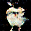
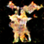

Pokemon Dataset from https://github.com/kvpratama/gan/tree/master/pokemon  
  
### Output Images  

### TODO
1. Image Augmentation by Roation and etc

### Issues
1. colab에서 runtime error 때문에 pytorch dataloader로 celeba dataset(13000장)을 불러오지 못하는것 같다.(13000장 -> 2000장으로 학습)